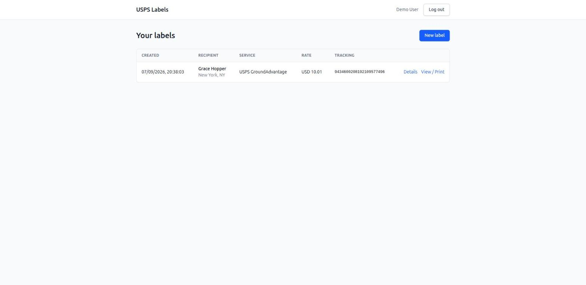
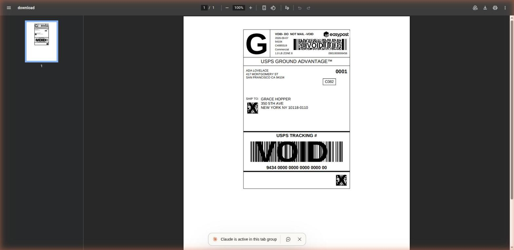

# USPS Shipping Labels (EasyPost take-home)

A small web app where a registered user enters a US origin address, a US destination address and package
dimensions, and gets a printable USPS shipping label bought through the [EasyPost](https://www.easypost.com/) API.
Labels are stored on the server and listed per user; users only ever see their own labels.

**Stack:** Laravel 13 (PHP 8.3) · Laravel Sanctum (SPA session auth) · MySQL 8.4 · React 19 + TypeScript · Vite · Tailwind v4

## Quick start

Prerequisites: PHP 8.3+, Composer, Node 20+, Docker (for MySQL) and an EasyPost **test** API key.

```bash
cp .env.example .env            # then set EASYPOST_API_KEY=<your EasyPost test key>
composer install && npm install
docker compose up -d            # MySQL 8.4 on 127.0.0.1:3306 (creates the app and test databases)
php artisan key:generate
php artisan migrate --seed      # creates the demo user
composer run dev                # Laravel on http://localhost:8000 + Vite dev server
```

Open `http://localhost:8000` and log in with **demo@example.com / password**, or register a new account.

Using your own MySQL instead of Docker: point the `DB_*` variables in `.env` at it, create the `take_home_project`
database (and `take_home_project_test` if you want to run the tests), then run the migrate step.

### Running the tests

```bash
docker compose up -d
php artisan test            # PHPUnit: auth, label purchase (EasyPost faked), history, isolation
npm run typecheck           # tsc --noEmit
npm run build
```

Tests never call EasyPost: every request is faked with `Http::fake()` and JSON fixtures in `tests/Fixtures/easypost/`.

## How it works

1. React posts `from_address`, `to_address` and `parcel` (oz / inches) to `POST /api/labels`.
2. `StoreLabelRequest` validates shape and enforces US-only addresses (state list, ZIP regex, `country = US`).
3. `CreateShippingLabel` calls EasyPost through `EasyPostClient`: create shipment (`label_format: PDF`) → pick the
   cheapest **USPS** rate → buy it → download the PDF → store it on the private `local` disk → save a `shipping_labels` row.
4. `GET /api/labels` lists the current user's labels; `GET /api/labels/{id}/download` streams the PDF inline for
   viewing/printing. Both are behind `auth:sanctum`; show/download also go through `ShippingLabelPolicy`.

All EasyPost calls happen in the backend. EasyPost's public label URL is stored for debugging but never returned by the API.

```
app/Actions/CreateShippingLabel.php      orchestration
app/Services/EasyPost/EasyPostClient.php the only place that talks to EasyPost
app/Services/EasyPost/RateSelector.php   lowest USPS rate
app/Http/Controllers/LabelController.php index / store / show / download
app/Http/Controllers/Auth/*              register / login / logout (Sanctum SPA mode)
resources/js/                            React + TypeScript SPA (pages, api, hooks, components)
```

### Screenshots

Label history after buying one test label:



The stored PDF served by the authenticated download route (EasyPost test mode, so it is stamped VOID):



## Assumptions and decisions

- **Prototype in a 4-hour box.** Functional and tested, not polished.
- **Test mode only.** Labels come back watermarked "SAMPLE" and cost nothing.
- **Carrier fixed to USPS, service picked automatically** (lowest rate). Rate selection UI was deliberately left out.
- **Imperial units** (oz, in) because shipping is US-only and that is what EasyPost expects.
- **Addresses are validated locally, not verified by EasyPost.** Strict verification in test mode tends to reject the
  fictional addresses a reviewer types; EasyPost's own errors are still surfaced as 422.
- **Labels are downloaded and stored locally** (`storage/app/private/labels/{user_id}/…`) instead of linking to
  EasyPost's public URL, so our auth layer gates every byte.
- **No retry on the buy call.** A lost response followed by a retry would purchase the same label twice. Create and
  download are retried twice on connection errors / 5xx.
- **If the buy succeeds but download/persistence fails** the request returns 502 and the shipment id + label URL are
  logged for manual recovery. No partial row is written.
- **Standard Laravel layout** rather than feature folders: two small areas (auth, labels) did not justify more structure.
- **No SDK.** Three REST calls are not worth a dependency, and the integration code stays visible.
- **Tests run against MySQL**, not sqlite, so the dialect under test is the one in production.
- **Sanctum SPA mode needs a referrer.** The PDF route (`/api/labels/{id}/download`) is only authenticated when the
  browser sends a same-origin `Referer`/`Origin`, which the app's "View / Print" links do. Pasting the URL into the
  address bar or opening a bookmark sends no referrer, so Sanctum sees a guest and redirects to `/login`. Acceptable for
  the prototype; a web (session) route for downloads would remove the limitation.

## What I'd do next

- Two-step flow: show the USPS rates and let the user pick the service before buying.
- EasyPost Address Verification (`verify_strict`) with a "confirm normalized address" step.
- Address book (reuse saved from/to addresses).
- Reconciliation job for labels bought at EasyPost but not persisted.
- Password reset and email verification.
- Frontend tests (Vitest + React Testing Library).
- Rate limiting and audit log on label purchases; CI running Pint, PHPUnit, typecheck and build.
- Return 404 instead of 500 when a label row exists but its PDF is missing from the disk.

## Notes on AI usage

Claude Code was used as a pair programmer: brainstorming the design, drafting the spec and implementation plan, and
generating code and tests task by task. Every decision above was made and reviewed by me, and I can walk through any
part of the codebase.
